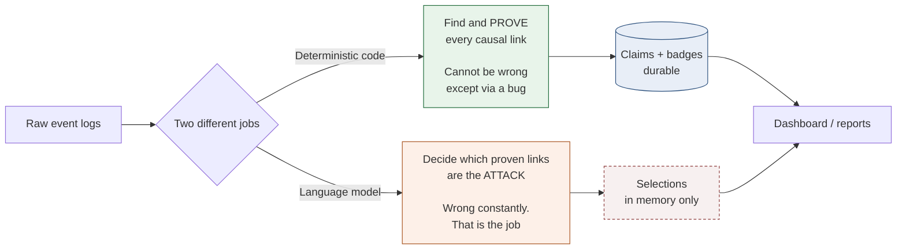
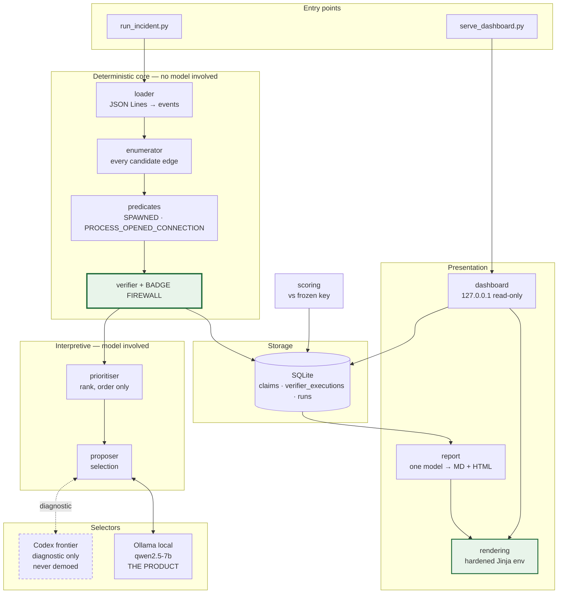
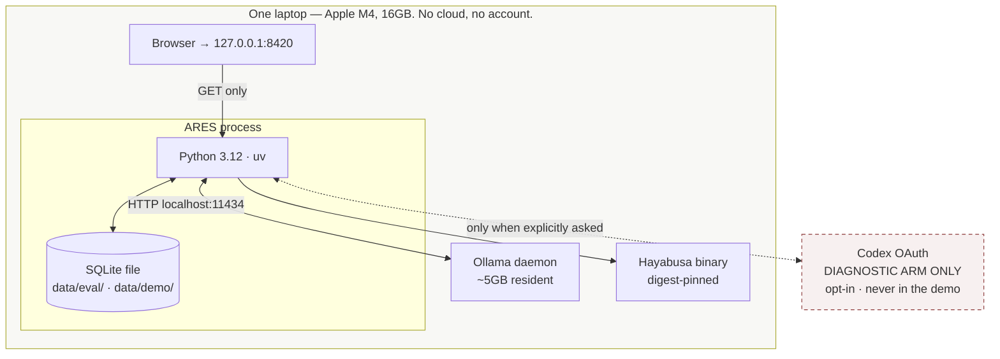
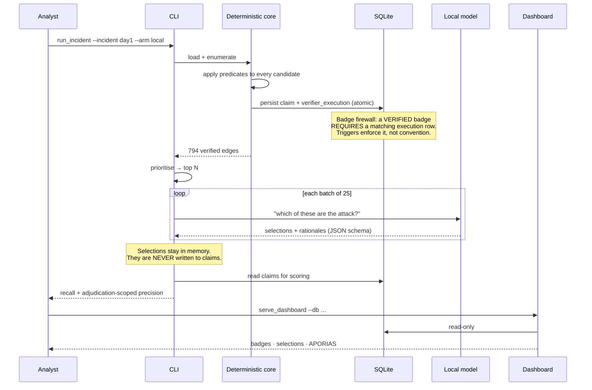
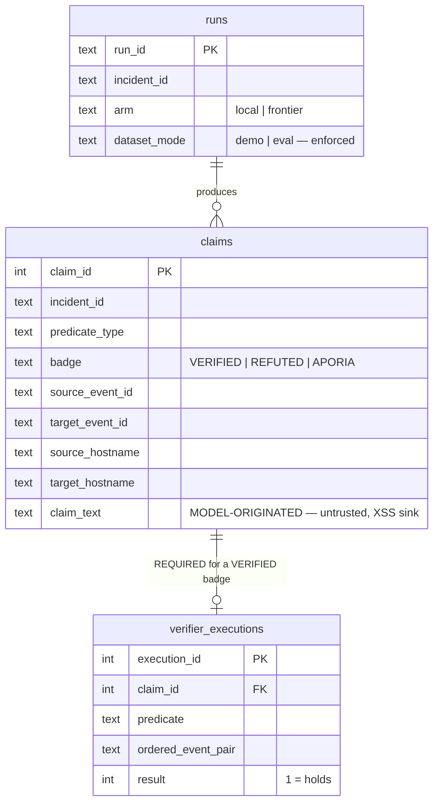
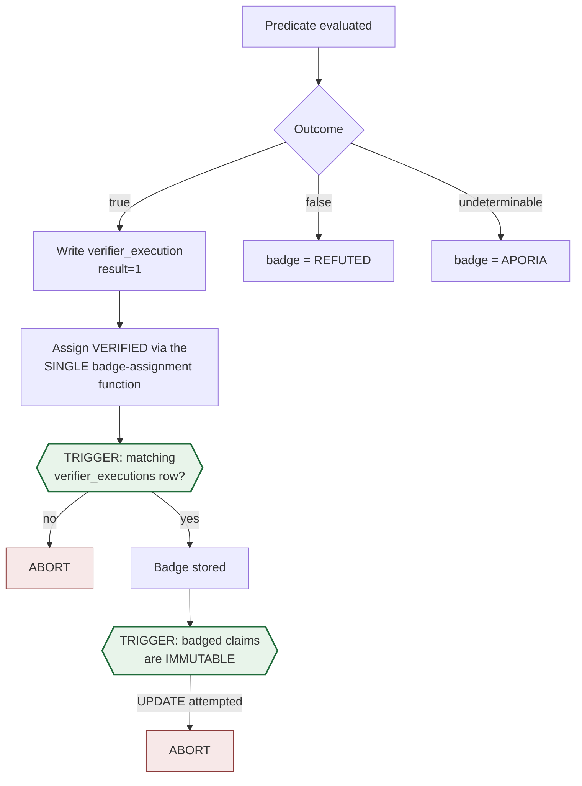
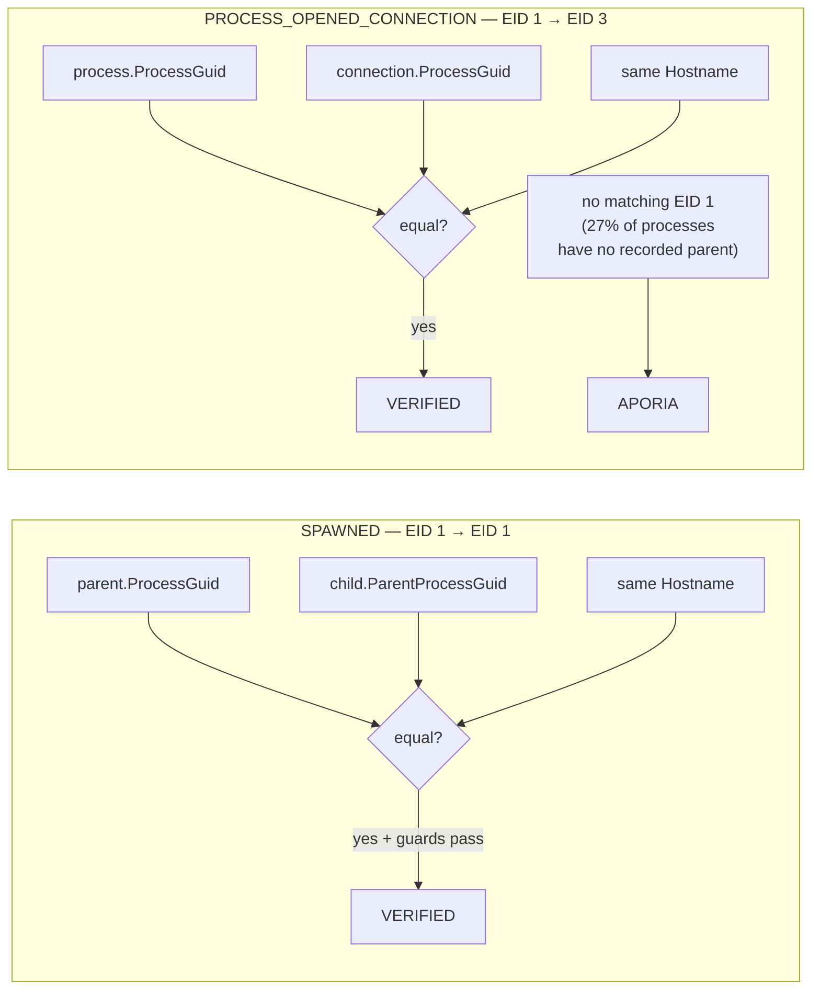
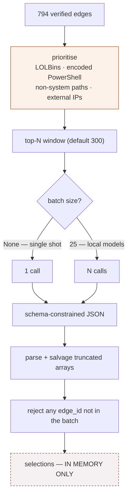
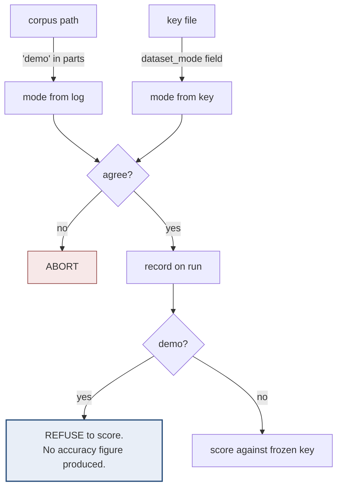
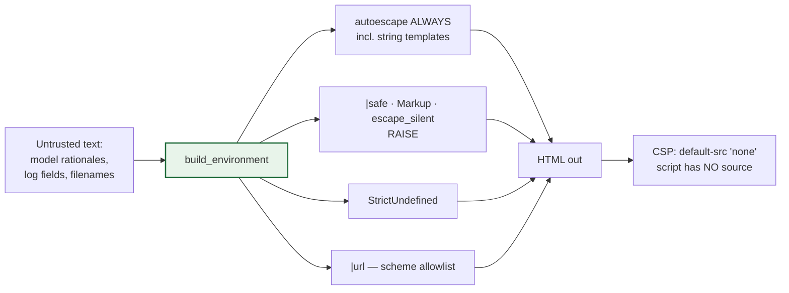

# ARES — High-Level and Low-Level Design

Describes **the system as built**, not as originally planned. Two predicates
ship, not four; the two cut ones are marked as such everywhere they appear.

Last updated 2026-08-02. Diagrams are Mermaid — they render on GitHub and in any
Markdown viewer, and deliberately pull no external JavaScript, because ARES's own
Content-Security-Policy forbids exactly that.

---

# Part 1 — High-Level Design

## 1.1 The one idea

Everything follows from a single split:

**The dashed box is the point.** Model selections are held in memory and never
enter the claims table. A model opinion cannot become a stored fact, because the
two never share storage.

## 1.2 Component view

## 1.3 Deployment

**Only the dashed box leaves the machine, and only on request.** Default
operation is fully local.

## 1.4 Data flow, end to end

---

# Part 2 — Low-Level Design

## 2.1 Data model

`claim_text` is model output. It is the reason `src/ares/rendering.py` exists.

## 2.2 The badge firewall

The project's central integrity control.

**Two independent layers, deliberately.** A single application-level function
would be one refactor away from a bypass. The triggers hold even if the Python is
wrong.

The immutability trigger exists because adversarial testing found a badged
claim's text could be rewritten *after* it was badged — a real leak, closed.

Blind adversarial testing found **eight** false-verification paths in code that
had already passed a phase gate and two reviews: self-parenting, mutual parenting,
longer cycles (A→B→C→A), duplicate GUIDs making the parent ambiguous, whitespace
identifiers, text/number type confusion, and a boolean accepted as an event type
(Python evaluates `True == 1` as true).

## 2.3 The two shipped predicates

Both are **host-scoped identifier joins**. That is why precision on adjudicated
edges is expected to sit at 100% — it is a floor, not an achievement.

**Cut from scope:** `WROTE_PATH_BEFORE_EXECUTION` and `SAME_SESSION`. They cover
5 of day 2's 23 true edges, permanently out of reach for this build. EID 3 carries
no `LogonId`, which is what makes `SAME_SESSION` expensive.

## 2.4 Selection path

**The prioritiser is the measured bottleneck.** On day 2, all 18 in-scope true
edges were enumerated but only 6 ranked inside the top 300 — a reachable ceiling
of 33.3%. Widening the window to 1500 moved the frontier arm 16.7% → 55.6% with
no model change. Ranking mattered more than model choice.

Ordering **never** affects a badge. It changes only what the model is shown.

## 2.5 Dataset-mode enforcement

Derived independently from two sources that must agree, so a wrong `--mode` flag
cannot override the filesystem and a wrong key cannot override the run.

Demo mode produces **no number at all**. A caveat printed beside a figure gets
cropped out of a screenshot; a figure that was never produced cannot be.

## 2.6 Rendering, hardened

Jinja **does not autoescape by default**; a bare `Environment` escapes nothing.
Escape hatches raise rather than render, so a template using one fails instead of
quietly creating an injection point.

`|url` exists because **autoescaping does not protect URL context** —
`javascript:alert(1)` in an `href` survives HTML-escaping completely intact. Found
while writing the regression suite for the escaping itself.

## 2.7 Measured results

| Arm | Incident | Window | Selection recall | Adjudicated precision |
|---|---|---|---|---|
| Frontier | day 1 | 300 of 794 | **66.7%** (22/33) | 33/33 |
| Frontier | day 2 | 1500 of 1704 | **55.6%** (10/18) | 18/18 |
| Local (qwen 7b, batch 25) | day 1 | 300 of 794 | **51.5%** (17/33) | 33/33 |
| Local, batch 75 / 100 / 300 | day 1 | 300 | 33.3% / 27.3% / **0%** | — |

Batch 300 returns a **well-formed empty answer** — the model declines rather than
fails. More context did not help; recall falls monotonically as the batch grows.

**Adjudication coverage: 33 of 794 badges (4.2%).** The key describes the attack
narrative, not every relation in the log, so it cannot rule on the other 761.
Precision figures here are scoped to what it can adjudicate and claim nothing
beyond it.

**Not measured:** day 2 on the local arm. That run was abandoned at 72% after
4h45m. Local is proven on one incident only.
